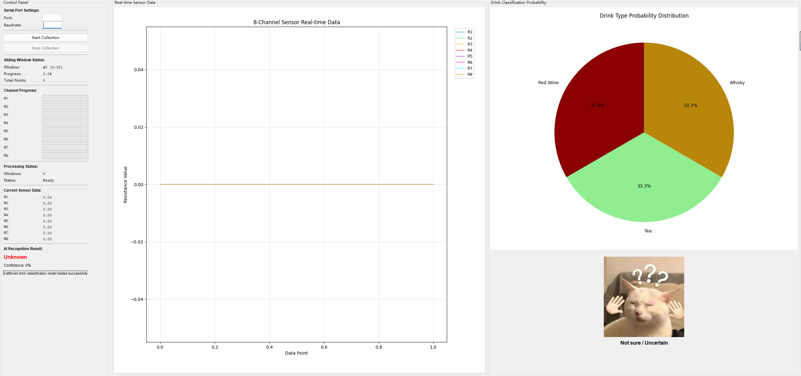

# Gas Sensor Drink Classification System  
# 气体传感器饮品识别系统

| 中文简介 | English Introduction |
|---------|---------------------|
| 本应用基于Bose气体传感器（型号：BME688），用于智能识别饮品类型。支持识别红酒、茶和威士忌。界面直观，支持一键运行，无需安装Python环境，适合展示和教学实验场景，支持离线运行。 | This application is based on the Bose gas sensor (Model: BME688), designed for intelligent drink type recognition. It supports recognition of red wine, tea, and whisky. The UI is intuitive, supports one-click operation without Python installation, suitable for demo and teaching experiments, and works offline. |

## 主要功能 | Main Features

- 支持BME688气体传感器数据实时采集  
  Real-time data acquisition with BME688 gas sensor  
- 智能识别红酒、茶和威士忌  
  Smart recognition of red wine, tea, and whisky  
- 可视化界面，操作简单  
  Intuitive and user-friendly GUI  
- EXE文件打包，双击即用  
  Packaged as an EXE file, ready to use  
- 离线运行，无需联网  
  Offline operation, no internet required  

## 设备信息 | Device Info

- 传感器型号：BME688（Bose Sensor）  
  Sensor Model: BME688 (Bose Sensor)  

